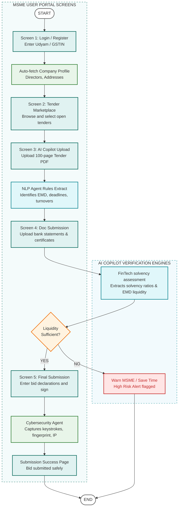
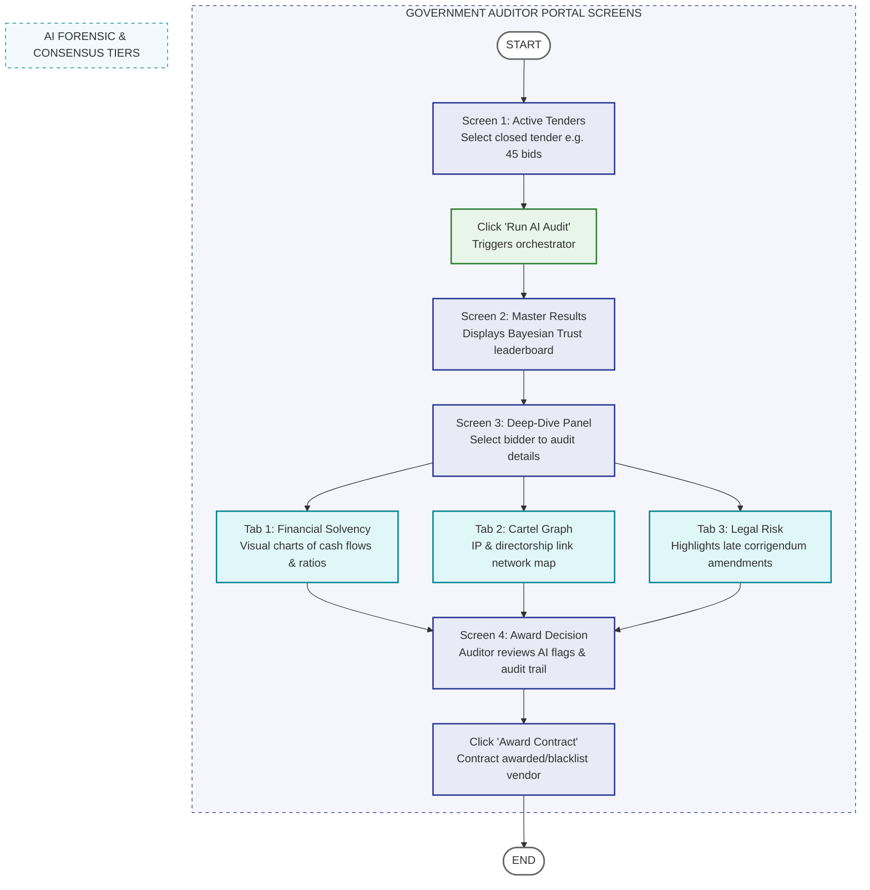

# Split User Experience Flowcharts (Mermaid.live Compatible)

Below are the separate Mermaid diagrams representing the two distinct user flows (Side A for MSMEs and Side B for Government Auditors). Copy and paste each code block individually into the [Mermaid Live Editor](https://mermaid.live/) to generate the diagrams.

---

## 1. Flow A: MSME Vendor Journey (Side A)

---

## 2. Flow B: Government Auditor Journey (Side B)

