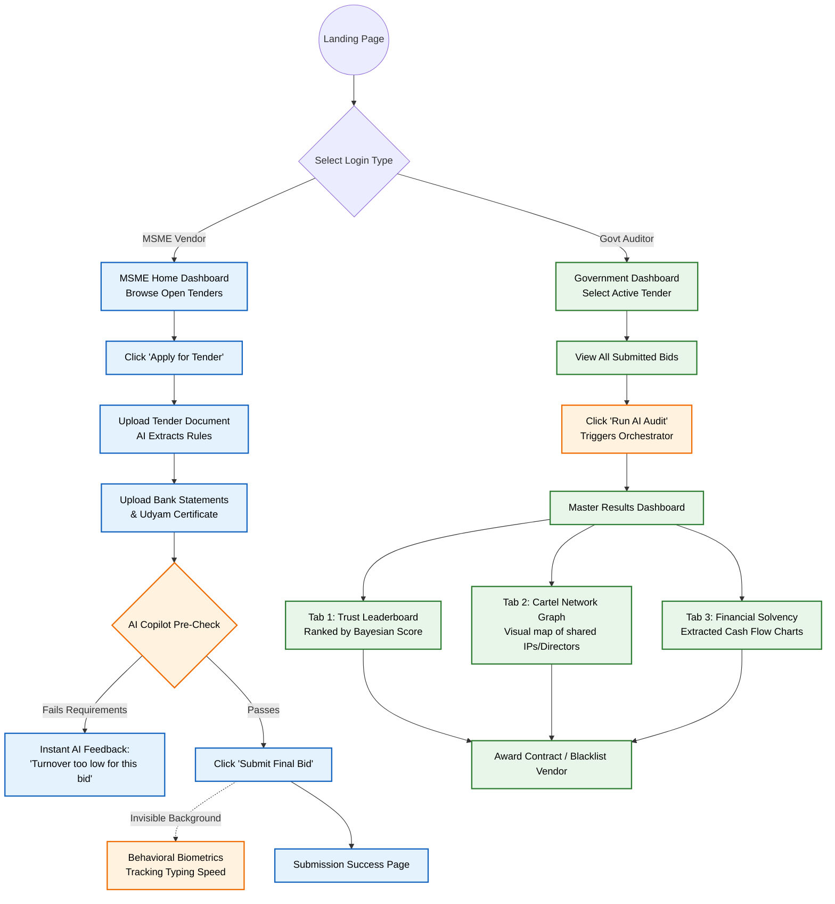
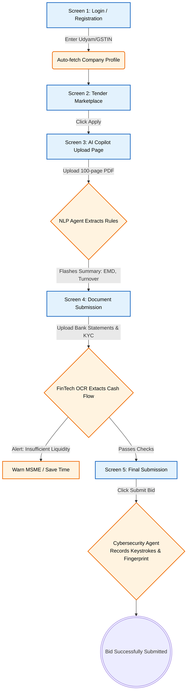
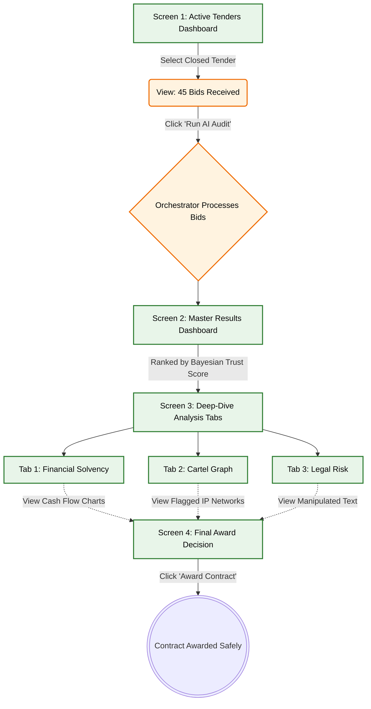

# User Experience (UX) Flow & Application Features

This document maps out the exact step-by-step journey a user takes when they interact with the **Intelligent Procurement Integrity Platform**. 

Because this is a **Dual-Sided Platform**, there are two entirely different User Interfaces (UIs) depending on who logs in: the **MSME (Vendor)** or the **Government Officer (Auditor)**.

---

## 1. Visual UX Flow Diagram (Mermaid)

*You can copy this into a Mermaid viewer to see the screen-by-screen flowchart of your application.*

---

## 2. The MSME Vendor Flow (Side A)

**Goal:** Help the MSME apply for a tender without needing an expensive bid consultant, while ensuring they are legally compliant.

### Screen 1: Registration & Login
*   **Action:** MSME logs in using their official Udyam Registration Number or GSTIN.
*   **Feature:** The system automatically pulls their company profile (Director names, registered address) from public databases.

### Screen 2: The Tender Marketplace Dashboard
*   **Action:** MSME browses a list of open government tenders.
*   **Feature:** They click "Apply" on a specific tender.

### Screen 3: The AI Copilot Upload Page
*   **Action:** The user uploads the 100-page Tender PDF.
*   **AI Feature (Agent 1):** The NLP Agent instantly reads the PDF and flashes a summary on the screen: *"To apply for this, you need ₹50,000 EMD, 3 years experience, and ₹1 Crore turnover."*

### Screen 4: Document Submission
*   **Action:** The user uploads their last 6 months of Bank Statements and experience certificates.
*   **AI Feature (Agent 3):** The FinTech OCR extracts the cash flow. If the MSME's bank balance is only ₹10,000, the AI flashes a warning: *"Alert: You do not have enough liquidity to pay the ₹50,000 EMD. Your bid will likely be rejected."* (This saves the MSME time).

### Screen 5: Final Submission (The Invisible Layer)
*   **Action:** The user types out a final declaration and clicks "Submit Bid".
*   **AI Feature (Agent 4):** In the background, the Cybersecurity Agent records their keystrokes and browser fingerprint to ensure they are a real human, not a bot script.

---

## 3. The Government Auditor Flow (Side B)

**Goal:** Give the government officer an X-ray vision dashboard to instantly spot fraud and rank the safest bidders.

### Screen 1: The Active Tenders Dashboard
*   **Action:** The government officer logs in and clicks on a specific tender (e.g., "Highway Construction Phase 1") that has just closed.
*   **Feature:** The screen shows "45 Bids Received. Run AI Audit?"

### Screen 2: The Master Results Dashboard (The Bayesian Leaderboard)
*   **Action:** The officer clicks "Run AI Audit". The Orchestrator processes all 45 bids.
*   **Feature:** The UI displays a ranked Leaderboard. Instead of sorting by "Lowest Price", it sorts by the **Bayesian Trust Score (0 to 100)**. 

### Screen 3: The Deep-Dive Tabs
If the officer clicks on a specific bidder (e.g., "Bidder Rank #1: ABC Infra"), they can see exactly *why* the AI gave them that score across three tabs:

*   **Tab 1 - Financial Solvency Chart:** Shows beautiful Bar Charts generated from the MSME's bank statements, proving they have positive cash flow.
*   **Tab 2 - The Cartel Graph:** Shows an interactive network web (Graph Data Science). If ABC Infra shares the same IP address as XYZ Infra, the UI highlights a red line connecting them, flagging a cartel.
*   **Tab 3 - Legal Corrigendum Risk:** If an officer amended the tender late to favor ABC Infra, the Semantic Diff engine highlights the exact manipulated text in red.

### Screen 4: Final Award
*   **Action:** The officer reviews the explainable AI evidence and clicks "Award Contract" to the safest, most compliant bidder.
